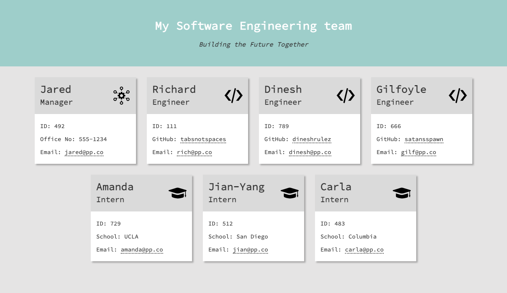
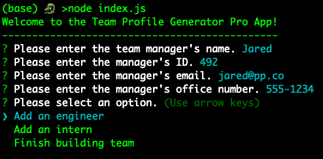
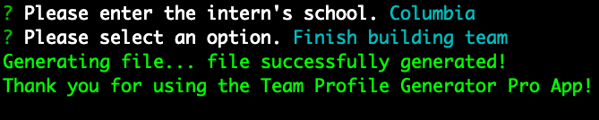
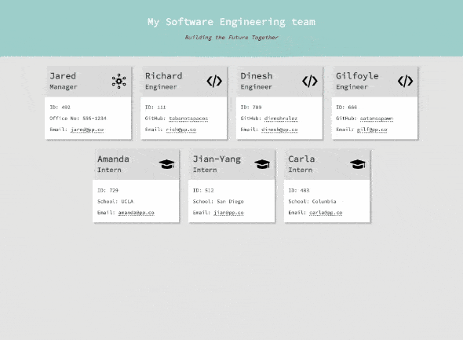

# Team Profile Generator

  

## Description

A Node.js command-line application that takes in information about members in a software engineering team, then generates an HTML webpage that displays basic summaries for each person.

## Table of contents

- [Getting Started](#getting-started)
- [What I Learned](#what-i-learned)
- [Features](#features)
- [Limitations and Future Enhancements](#limitations-and-future-enhancements)
- [Tests](#tests)
- [Contribution](#contribution)
- [Credits](#credits)

## Getting started

1. Download or clone the repository
2. Navigate to the repository folder in your terminal
3. Run `npm i` to install dependencies
4. Run `node index.js` to start the app

Upon starting the app, you will be prompted to enter details about the manager. A menu will then appear, giving you options to add details about engineers and interns.

You can add an unlimited number of engineers and interns. To complete building the team, select the "Finish building team" option. This will render the HTML file in the output folder and end the app.

## What I Learned

In this project, I gained experience in:

- Building Node.js apps with a modular file structure, where each module performs a specific task.
- Creating objects using class structures, with a focus on inheritance.
- Implementing unit testing to aid app development.
- Validating user input using regular expressions.
- Generating dynamic webpages using stored data, array methods, and template literals.
- Styling webpages with a mobile-first approach using CSS.

## Features

The HTML file that is rendered by the app is responsive to different screen sizes.

## Limitations and Future Enhancements

1. Module Import: Currently, the app uses the older `require()` method for importing modular files. Future enhancements may include switching to the newer `import` syntax.
2. Asynchronous Operations: The app handles asynchronous operations using promise chaining. An enhancement could be to use the async-await method for improved readability and simplicity.
3. Limited Features: The app is currently limited to adding information about three roles in a single team once. Future improvements could include the ability to add more roles, to edit stored data, and to add information about multiple teams.

## Tests

To run the basic tests, in your terminal run `npm test`.

## Contribution

If you're excited about this project and want to get involved, that'd be awesome! Here are a few ways you can contribute:

1. Fork the repository and create a pull request with your changes.
2. Submit an issue to report bugs or request new features.
3. Help improve the documentation.

Please follow the guidelines for contributions:

- Make sure your code is well-documented and follows the same style as the rest of the codebase.
- Keep pull requests small and focused on a single change.
- Include test cases for any new features or changes.

If you have any questions or suggestions, feel free to contact me via [email](mailto:sb1664@gmail.com).

## Credits

- <a href="https://nodejs.org/en/" target="_blank">Node.js</a>
- <a href="https://www.npmjs.com/package/inquirer" target="_blank">Inquirer</a>
- <a href="https://www.npmjs.com/package/jest" target="_blank">Jest</a>
- <a href="https://developer.mozilla.org/en-US/docs/Web/JavaScript/Reference/Classes" target="_blank">Classes - JavaScript [Mozilla]</a>

  <a href="#top">Back to top</a>

