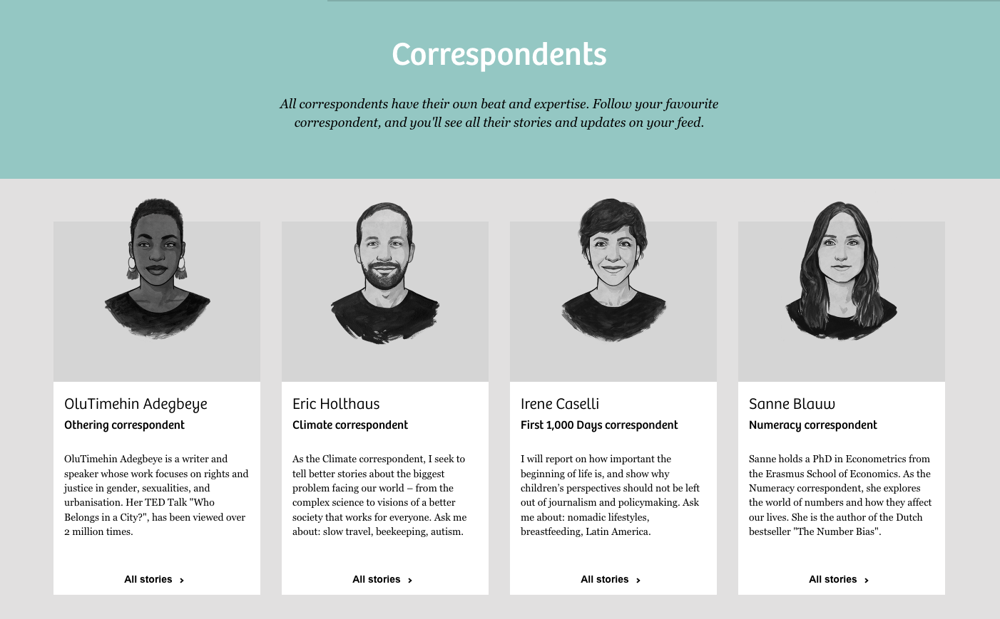

# Team Profile Generator

  

## Description

A Node.js command-line application that takes in information about members in a software engineering team, then generates an HTML webpage that displays basic summaries for each person.

## Table of contents

- [Getting Started](#getting-started)
- [What I Learned](#what-i-learned)
- [Features](#features)
- [Limitations and Future Enhancements](#limitations-and-future-enhancements)
- [Tests](#tests)
- [Contribution](#contribution)
- [Credits](#credits)

## Getting started

1. Download or clone the repository
2. Navigate to the repository folder in your terminal
3. Run `npm i` to install dependencies
4. Run `node index.js` to start the app

### Using the app

Upon starting the app, you will be prompted to enter basic information about a manager. Afterwards, a menu will appear, giving you options to add details about either an engineer or an intern.

Information about an unlimited number of engineers and interns can be added. Once finished, selecting the "Finish building team" option will render the desired HTML file in the `output` folder and end the app.

## What I Learned

In this project, I gained experience in:

- Building a Node.js app with a modular file structure, where each module performs a specific task.
- Creating objects using class structures, with a focus on inheritance.
- Implementing unit testing to aid app development.
- Validating user input using regular expressions.
- Generating dynamic webpages using stored data, array methods, and template literals.
- Styling webpages with a mobile-first approach using CSS.

### Challenges

- Asynchronous operations: Struggled to add a menu after page render, likely due to lack of understanding of promises.
- Flexbox: Had difficulty getting items to take a specific percentage of container width. Tried using flex-basis and box-sizing, but realised margin wasn't factored in.

Recommend future study of JavaScript promises and CSS Flexbox.

## Features

The HTML file rendered by the app is designed to adapt to various screen sizes for a responsive display.

## Limitations and Future Enhancements

1. Module Import: Currently, the app uses the older `require()` method for importing modular files. So a future enhancement could be to switch to the newer `import` syntax.
2. Asynchronous Operations: The app handles asynchronous operations using promise chaining. An enhancement could be to use the async-await method for improved readability and simplicity.
3. Limited Features: The app is currently limited to adding information for only three roles in a single team once. Future improvements could include the ability to add more roles, edit stored data, and to add information about multiple teams.

## Tests

To run the basic tests, in your terminal run `npm test`.

## Contribution

If you're excited about this project and want to get involved, that'd be awesome! Here are a few ways you can contribute:

1. Fork the repository and create a pull request with your changes.
2. Submit an issue to report bugs or request new features.
3. Help improve the documentation.

Please follow the guidelines for contributions:

- Make sure your code is well-documented and follows the same style as the rest of the codebase.
- Keep pull requests small and focused on a single change.
- Include test cases for any new features or changes.

If you have any questions or suggestions, feel free to contact me via [email](mailto:sb1664@gmail.com).

## Credits

The color scheme and layout for the rendered HTML file were influenced by [The Correspondent website](https://thecorrespondent.com/correspondents).

Other credits:

- <a href="https://nodejs.org/en/" target="_blank">Node.js</a>
- <a href="https://www.npmjs.com/package/inquirer" target="_blank">Inquirer</a>
- <a href="https://www.npmjs.com/package/jest" target="_blank">Jest</a>
- <a href="https://developer.mozilla.org/en-US/docs/Web/JavaScript/Reference/Classes" target="_blank">Classes - JavaScript [Mozilla]</a>
- <a href="https://fonts.google.com/specimen/Source+Code+Pro" target="_blank">Source Code Pro [Google Fonts]</a>
- <a href="https://www.youtube.com/playlist?list=PL4cUxeGkcC9hH1tAjyUPZPjbj-7s200a4" target="_blank">Mobile-First Responsive Build by The Net Ninja [YouTube]</a>
- <a href="https://blog.hubspot.com/marketing/creative-agency-team-pages" target="_blank">20 Best 'Meet the Team' Pages We've Ever Seen by Karla Hesterberg [HubSpot]</a>
- <a href="https://stackoverflow.com/a/45059944" target="_blank">Flex items not respecting margins and box-sizing: border-box [Stack Overflow]</a>

  <a href="#top">Back to top</a>

